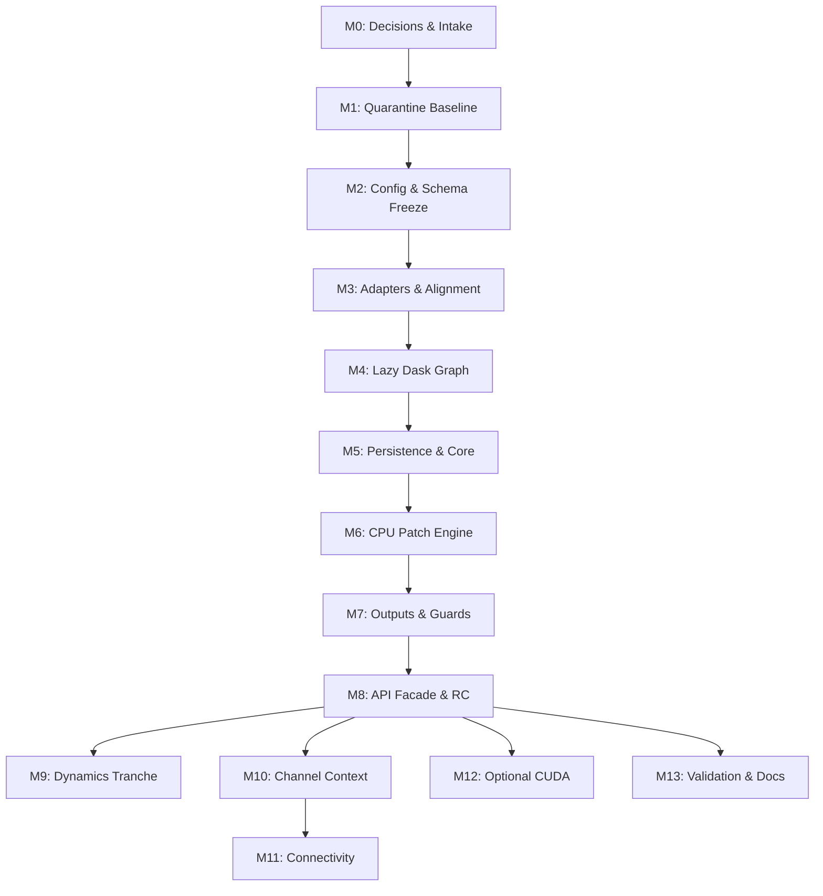

# HydroFragments v1.2 Execution Checklist

This checklist is the normative execution guide for coding agents. Before starting any work, the agent must ingest `docs/audit/implementation_plan.md` and this checklist.

---

## 1. Executive Plan (One-Page Summary)



### Core Architecture Strategy
1. **Stabilize Core First**: Lock input decoding, CRS alignment, schema formats, and configuration hashing before implementing metric algorithms.
2. **Dask-First / Lazy-First**: Ensure temporal reductions and pixel metrics are lazily evaluated in Dask. Materialization occurs only at defined pipeline boundaries.
3. **CPU Parity Priority**: CPU outputs are the scientific gold standard. CUDA acceleration is optional and requires exact numerical parity with CPU.
4. **Tidy Partitioned Data**: All outputs must conform to a standardized tidy schema stored in partitioned Parquet format.

### Model Routing Rule
Use three ranked candidate models for each milestone: first choice, second choice, and third choice, each with the reason to use it. Do not default to Codex unless codebase-grounded implementation, tool use, or diff control is the real deciding factor. Prefer documentation/reasoning models for evidence synthesis, manager language, and adversarial critique; prefer coding-agent models for schema, validity, Dask laziness, scientific metric math, and release gates.

Available model pool recorded for this plan: Codex 5.6 high (sol/luna/terra), Codex 5.4 medium, Composer 2.5, Gemini 3.5 Flash high, Gemini Pro 3.1 medium/high, Kimi 2.7 medium/high, Claude Sonnet medium/high, Claude Opus high, Claude Fable high, Grok 4.5 high.

---

## 2. Stop/Go Gates & Global Constraints

### Global Constraints (Pass/Fail)
* [ ] **Audit Intake**: No developer or subagent may use summaries in place of reading raw audit logs under `docs/audit/`.
* [ ] **Sentinel Safety**: Values `254` and `255` must be decoded before signed casts. Never treat them as dry or water.
* [ ] **No Hybrid Schema**: Never output legacy metrics (`PF`, `PLF`, `AWMPA`, `AWMPL`, original `AWMPW`, `NNI`) in v1.2 output.
* [ ] **Lazy Invariance**: Scientific functions must not trigger eager computation (`.compute()`, `.values`, `np.asarray()`).
* [ ] **Strict Denominator**: Occurrence and Refuge Area (RA) calculations require resolved validity semantics. Do not compute using simple temporal length.

### Gate 0 (Pre-flight Decision Gate)
Must create `docs/audit/decisions.md` resolving:
* [ ] **U1**: Fixture attributes (CRS, dimensions, cadence, usage).
* [ ] **U2/Q1**: Valid-observation denominator policy.
* [ ] **U3/Q3**: Dual-composite availability and dry-down compositing ownership.
* [ ] **U4/Q6**: Drainage dataset topology and availability.
* [ ] **U7**: Disposition of legacy baseline CSV.
* [ ] **Q2**: Canonical input schema.
* [ ] **Q4**: connectivity citation-only vs. implementation scope.
* [ ] **Q5**: Compatibility adapter facade design.
* [x] **Q7**: HY authority = external `hydroseason` contract (version pin, config, drought/fallback behaviour). *(2026-07-16: hydroseason frozen at v0.1.0, HEAD `4d5eec8`; V8 manually verified 100% agreement Fitzroy/Gilbert; approved in decisions.md.)*
* [ ] **Q8**: Validation fixtures.
* [ ] **Q9**: Config hashing rules.
* [ ] **Q10**: Governance record for predecessor history.

---

## 3. Detailed Milestone Checklist

### Milestone 0: Evidence, Intake, and Decisions
* **Model Options**:
  * First choice: Composer 2.5 - best fit for decision-table drafting, cross-document synthesis, and keeping the milestone documentation-first.
  * Second choice: Codex 5.6 high (luna) - use when the intake needs tight repo-grounded file inspection, digests, and workspace edits.
  * Third choice: Gemini 3.5 Flash high - cheapest broad inventory pass when only file lists, summaries, and unresolved-question extraction are needed.
* **Exact Prompt**:
```text
You are implementing HydroFragments v1.2 Milestone 0 only.
Use `test-driven-development` for every implementation change and `verification-before-completion` before claiming completion.
Read every Markdown file under docs/audit/ directly, then read docs/HydroFragments_v1.2_spec.md and docs/audit_implementation_plan.md. Do not use summaries instead of raw audit files.
Create docs/audit/intake_manifest.md with path, SHA-256 digest, read timestamp, reader/model, and unresolved-decision references.
Create docs/audit/decisions.md covering U1-U4, U7, and Q1-Q10 with decision, evidence artifact, owner, approval date/status, consequence if wrong, and affected milestone.
Add evidence files for fixture inventory, upstream validity contract, drainage inventory, and regression baseline where supported by actual files.
Write or specify test-first fixture inspection that reports dimensions, CRS, cadence, value domain, sentinel presence, wet-fraction variability, and checksum without mutating data.
Stop if any decision lacks evidence or owner. Do not edit production code.
```
* **Tasks**:
  * [x] Ingest all audit logs in `docs/audit/`.
  * [x] Create `docs/audit/intake_manifest.md` with SHA-256 digests and timestamped approvals.
  * [x] Create `docs/audit/decisions.md` containing closed decisions for U1–U4, U7, Q1–Q10.
* **Test-First Requirements**:
  * [x] Write automated fixture inspector verifying dimensions, sentinel presence, and cadence of test datasets.
  * [x] Compare occurrence under native vs. filled validity policies on test Zarr.
* **Risk Gate**: Low. Plan halts immediately if any decision is left "unresolved" or missing ownership.
* **Acceptance Criteria**: Manifest and decisions file exist and are approved; release scope restricts subsequent milestones based on closed decisions.

### Milestone 1: Characterization Suite & Baseline Quarantine
* **Model Options**:
  * First choice: Codex 5.6 high (luna) - best fit for test reorganization, fixture wiring, and legacy quarantine edits.
  * Second choice: Composer 2.5 - good for fixture documentation, test naming, and sanity-checking the quarantine narrative.
  * Third choice: Codex 5.6 high (sol) - use only if legacy behavior conflicts with v1.2 contracts and needs stronger reasoning.
* **Exact Prompt**:
```text
You are implementing HydroFragments v1.2 Milestone 1 only.
Use `test-driven-development` for every implementation change and `verification-before-completion` before claiming completion.
First ingest docs/audit/implementation_plan.md, docs/audit/execution_checklist.md, and all raw Markdown files under docs/audit/. Confirm docs/audit/decisions.md exists and does not block this milestone.
Use test-first workflow. Create tests/legacy and tests/contracts structure. Quarantine tests/results_iRiverMetrics/metrics/irm_metrics.csv so it cannot be used as a v1.2 correctness baseline.
Retain legacy comparisons only for approved low-level kernel smoke behavior. Add analytic fixtures for diagonal connectivity, one-pixel noise, empty masks, holes, long bars, and chunk-crossing components.
Add an explicit canonical test proving legacy CSV loading fails or is rejected for v1.2 runs.
Run focused pytest collection. Do not implement new v1.2 numerical kernels.
```
* **Tasks**:
  * [x] Quarantine legacy CSV metrics from canonical validation suite.
  * [x] Retain legacy comparisons solely for smoke testing low-level kernels.
  * [x] Add unit testing directory structure under `tests/legacy` and `tests/contracts`.
* **Test-First Requirements**:
  * [x] Assert legacy baseline loader fails on canonical v1.2 run pipeline.
  * [x] Create analytic test fixtures: diagonal connectivity, 1-pixel noise, empty masks, chunk-crossing components.
* **Risk Gate**: Low-Medium. Legacy regressions must not sneak into validation expectations.
* **Acceptance Criteria**: Fast and slow test collection succeeds; legacy metrics are excluded from canonical runs.

### Milestone 2: Config, Schema, Registry, & Public-Contract Freeze
* **Model Options**:
  * First choice: Codex 5.6 high (sol) - best fit because schema/config contracts need exact repo edits, tests, and migration-safe diff control.
  * Second choice: Composer 2.5 - good for API shape review, docs/config wording, and catching unclear public-contract language.
  * Third choice: Claude Opus high - use for adversarial scientific naming and contract critique after the diff is small.
* **Exact Prompt**:
```text
You are implementing HydroFragments v1.2 Milestone 2 only.
Use `test-driven-development` for every implementation change and `verification-before-completion` before claiming completion.
Read docs/audit/implementation_plan.md, docs/audit/execution_checklist.md, docs/HydroFragments_v1.2_spec.md, docs/audit/decisions.md, and all raw audit Markdown needed for schema/config decisions.
Use TDD. Before implementation, write tests/contracts for unknown config keys, conditional dependencies, scientific-vs-execution config separation, stable config_hash golden values, exact output columns/types/enums, forbidden metric IDs, dependency skips, and low-valid record construction.
Implement hydrofragments/config.py, hydrofragments/schema.py, hydrofragments/models.py, and hydrofragments/metrics/registry.py only as needed to pass those tests.
Forbidden v1.2 metric IDs include PF, PLF, AWMPA, AWMPL, original AWMPW, NNI, degree centrality, and betweenness centrality.
Do not expand numerical kernels. Stop for review if any schema field needs a new scientific decision.
```
* **Tasks**:
  * [x] Implement `hydrofragments/config.py`, `schema.py`, `models.py`, `metrics/registry.py`.
  * [x] Define `config_hash` rules (SHA-256 on scientific settings; exclude paths/accelerator/workers).
* **Test-First Requirements**:
  * [x] Test config parser rejects unknown keys and enforces conditional dependencies.
  * [x] Golden tests for cross-platform stability of `config_hash`.
  * [x] Reject forbidden metric IDs on schema initialization.
* **Risk Gate**: High. Changes to schema after this point cause cascading failures. Tag commit and enforce strict review.
* **Acceptance Criteria**: Schema holds all target metrics and flags; minimal profile resolves to core-only.

### Milestone 3: Input Adapters, Validity, Spatial Alignment, and Cadence
* **Model Options**:
  * First choice: Codex 5.6 high (sol) - best fit because sentinel decoding, validity, CRS checks, and adapter boundaries are code-heavy and failure-prone.
  * Second choice: Gemini Pro 3.1 high - strong adversarial reviewer for geospatial alignment, Dask backing, and performance edge cases.
  * Third choice: Composer 2.5 - use for input-format documentation and making validity semantics readable after tests pass.
* **Exact Prompt**:
```text
You are implementing HydroFragments v1.2 Milestone 3 only.
Use `test-driven-development` for every implementation change and `verification-before-completion` before claiming completion.
Read the raw audit files, docs/audit/implementation_plan.md, docs/audit/execution_checklist.md, docs/HydroFragments_v1.2_spec.md, and the approved docs/audit/decisions.md validity/input decisions.
Use TDD. Write failing tests for decoding 254 and 255 before signed casts, preserving valid/provenance masks, Dask-backed arrays, grid/transform/CRS mismatch errors, geographic CRS rejection unless explicitly configured, and cadence detection.
Implement hydrofragments/io/adapters.py, hydrofragments/io/validity.py, hydrofragments/io/alignment.py, hydrofragments/spatial/crs.py, hydrofragments/spatial/context.py, and hydrofragments/temporal/cadence.py.
Never treat 254 or 255 as dry or water. Do not silently resample or reproject. Stop if validity policy is unresolved.
```
* **Tasks**:
  * [x] Implement `hydrofragments/io/adapters.py`, `io/validity.py`, `io/alignment.py`.
  * [x] Implement `hydrofragments/spatial/crs.py`, `spatial/context.py`, `temporal/cadence.py`.
* **Test-First Requirements**:
  * [x] Verify decoding of `254` and `255` sentinels before signed cast.
  * [x] Test grid, transform, and CRS mismatch raises explicit errors.
  * [x] Check geographic CRS input fails without reprojection or explicit per-pixel-area configurations.
* **Risk Gate**: High. Misaligned inputs silently corrupt metric arithmetic.
* **Acceptance Criteria**: Upstream test Zarr parses; validity policy matches decisions.md; arrays remain Dask-backed.

### Milestone 4: Dask Temporal Graph, Chunk Contracts, & Checkpoint
* **Model Options**:
  * First choice: Codex 5.6 high (sol) - best fit for Dask laziness tests, orchestration boundaries, and checkpoint implementation.
  * Second choice: Gemini Pro 3.1 high - strong second opinion for chunk policy, scheduler overhead, and performance traps.
  * Third choice: Codex 5.6 high (luna) - use for narrower test fixes once the Dask architecture is already settled.
* **Exact Prompt**:
```text
You are implementing HydroFragments v1.2 Milestone 4 only.
Use `test-driven-development` for every implementation change and `verification-before-completion` before claiming completion.
Read docs/audit/implementation_plan.md, docs/audit/execution_checklist.md, relevant raw Dask/CUDA audit Markdown, and decisions.md.
Use TDD. Write tests that chunk byte budgets reject unsafe arrays, temporal composite/reduction stages remain lazy until the monthly checkpoint, no scientific function calls .compute(), .values, or np.asarray() on Dask collections, and checkpoint reuse avoids upstream recomputation.
Implement hydrofragments/compute/policy.py, hydrofragments/compute/chunks.py, hydrofragments/temporal/composites.py, and pipeline assembly in hydrofragments/pipeline.py.
Materialization may occur only in orchestration/checkpoint code and must be visible in diagnostics. CPU-only execution must work.
```
* **Tasks**:
  * [x] Implement `hydrofragments/compute/policy.py`, `compute/chunks.py`.
  * [x] Implement `hydrofragments/temporal/composites.py`, `hydrofragments/pipeline.py`.
* **Test-First Requirements**:
  * [x] Test chunk byte budget rejects unsafe chunk sizes.
  * [x] Assert pipeline operations remain lazy up to the designated monthly checkpoint.
  * [x] Test that reusing a checkpoint does not trigger upstream recomputations.
* **Risk Gate**: Medium. Avoidable spills or eager computations degrade memory/performance.
* **Acceptance Criteria**: Reductions are lazy; chunk diagnostics are populated in manifest; runs successfully on CPU-only.

### Milestone 5: Persistence and Fixed-Area Core Reductions
* **Model Options**:
  * First choice: Codex 5.6 high (sol) - best fit for exact occurrence/APSEC implementation, denominator tests, and guard integration.
  * Second choice: Claude Opus high - use for independent formula and hydrology-interpretation critique on a compact evidence packet.
  * Third choice: Composer 2.5 - use for clear guard messages, docs wording, and user-facing caveats after math is verified.
* **Exact Prompt**:
```text
You are implementing HydroFragments v1.2 Milestone 5 only.
Use `test-driven-development` for every implementation change and `verification-before-completion` before claiming completion.
Read implementation_plan.md, execution_checklist.md, decisions.md, and raw audit files relevant to validity denominators, APSEC, and manager interpretation.
Use TDD. Write analytic tests proving occurrence uses valid-observation counts, never total timesteps; RA obeys approved validity/refuge threshold semantics; APSEC uses fixed AOI area across empty/all-wet/clipped cases; and comparison rejects mismatched AOIs.
Implement hydrofragments/metrics/persistence.py, hydrofragments/metrics/extent.py, hydrofragments/guards/scientific.py, and hydrofragments/output/rasters.py.
Do not implement LPSEC, wet-derived lengths, HY metrics, channel metrics, or unresolved RA behavior. Stop if denominator policy is not closed.
```
* **Tasks**:
  * [x] Implement `hydrofragments/metrics/persistence.py`, `metrics/extent.py`.
  * [x] Implement `hydrofragments/guards/scientific.py`, `output/rasters.py`.
* **Test-First Requirements**:
  * [x] Assert occurrence uses valid-observation denominator, never total steps.
  * [x] Verify APSEC against fixed AOI area, testing empty/all-wet/clipped boundaries.
  * [x] Verify comparison API rejects runs with mismatched AOIs.
* **Risk Gate**: High. Incorrect validity masks alter all occurrence outputs.
* **Acceptance Criteria**: Core persistence and extent tables are tidy and correct; LPSEC/wet-derived lengths are absent.

### Milestone 6: Exact CPU Patch Engine and Minimal Patch Metrics
* **Model Options**:
  * First choice: Codex 5.6 high (sol) - best fit for exact CPU morphology code, chunk-invariant labeling, and analytic tests.
  * Second choice: Gemini Pro 3.1 high - strong adversarial reviewer for shape edge cases, chunk behavior, and scaling risks.
  * Third choice: Claude Opus high - use for scientific morphology interpretation after implementation evidence exists.
* **Exact Prompt**:
```text
You are implementing HydroFragments v1.2 Milestone 6 only.
Use `test-driven-development` for every implementation change and `verification-before-completion` before claiming completion.
Read implementation_plan.md, execution_checklist.md, spec sections for N/LPI/AWRe/AWMSI, decisions.md, and raw audit files covering patch morphology.
Use TDD with tiny analytic masks first. Test 4- vs 8-neighbor connectivity, label normalization across chunk boundaries, minimum mapping unit of 3 pixels applied globally, holes/long bars/noise, LPI fixed-area denominator, AWRe major-axis fallback, and AWMSI analytic truth.
Implement hydrofragments/patches/labels.py, hydrofragments/patches/components.py, hydrofragments/patches/morphology.py, and hydrofragments/metrics/patches.py for N, LPI, AWRe, and AWMSI only.
Keep CPU as reference. Do not implement MESH, width distributions, CUDA morphology, transient patch lineage, or survival models.
```
* **Tasks**:
  * [x] Implement `hydrofragments/patches/labels.py`, `patches/components.py`, `patches/morphology.py`.
  * [x] Implement `hydrofragments/metrics/patches.py` (N, LPI, AWRe, AWMSI).
* **Test-First Requirements**:
  * [x] Assert label ID normalization across chunk boundaries (4- vs 8-neighbor connectivity).
  * [x] Test patch minimum mapping unit (3 pixels) applies globally.
  * [x] Verify AWRe major-axis fallback matches analytic math.
* **Risk Gate**: High. Component morphology math must be invariant to chunk layouts.
* **Acceptance Criteria**: Component properties match analytical truth; MESH and width distributions remain disabled.

### Milestone 7: Tidy Output, Manifests, Comparison Guards, and Export Isolation
* **Model Options**:
  * First choice: Codex 5.6 high (sol) - best fit for manifest/schema enforcement, Parquet tests, and comparison guard implementation.
  * Second choice: Composer 2.5 - good for output docs, migration wording, and manifest readability.
  * Third choice: Codex 5.6 high (luna) - use for narrower Parquet/path test fixes after contracts are set.
* **Exact Prompt**:
```text
You are implementing HydroFragments v1.2 Milestone 7 only.
Use `test-driven-development` for every implementation change and `verification-before-completion` before claiming completion.
Read implementation_plan.md, execution_checklist.md, output schema sections, decisions.md, and raw audit files relevant to outputs and comparison guards.
Use TDD. Write tests for tidy output column order/types/nullability, Parquet partition paths, config JSON and manifest content, comparison guard rejection by default, optional CSV flattening, and no patch-geometry memory accumulation when vector export is disabled.
Implement hydrofragments/output/tables.py, hydrofragments/output/manifest.py, and hydrofragments/guards/comparison.py.
Output must be self-contained and must not include dropped legacy metrics. Vector export must be isolated and must not recompute metrics.
```
* **Tasks**:
  * [x] Implement `hydrofragments/output/tables.py`, `output/manifest.py`.
  * [x] Implement `hydrofragments/guards/comparison.py`.
* **Test-First Requirements**:
  * [x] Verify output schema types, nullability, and Parquet partition paths.
  * [x] Test comparison guard rejects mismatched inputs by default.
  * [x] Confirm memory does not accumulate patch geometries when vector export is disabled.
* **Risk Gate**: Medium. Output formats are user-visible. Version changes must support backward-compatible reads.
* **Acceptance Criteria**: End-to-end core runs output self-contained Parquet, config JSON, manifest, and rasters.

### Milestone 8: Public Namespace, Compatibility Facade, Docs, & Release Candidate
* **Model Options**:
  * First choice: Codex 5.6 high (sol) - best fit for package namespace changes, compatibility facade tests, and release-gate checks.
  * Second choice: Composer 2.5 - strong for migration guide, README, and API docs clarity.
  * Third choice: Claude Sonnet high - use for user-facing docs review after behavior is locked.
* **Exact Prompt**:
```text
You are implementing HydroFragments v1.2 Milestone 8 only.
Use `test-driven-development` for every implementation change and `verification-before-completion` before claiming completion.
Read implementation_plan.md, execution_checklist.md, docs audit files, decisions.md, and current packaging files.
Use TDD. Write tests that hydrofragments imports cleanly, ecofragments compatibility facade routes retained calls with deprecation warnings, requests for dropped legacy metrics raise explicit migration errors, package metadata exposes the new namespace, and install/import works in clean GPU-free environments.
Rebrand public package namespace to hydrofragments, implement the ecofragments facade without duplicate kernels, update pyproject.toml, README.md, API docs, and migration notes.
Do not restore dropped metrics for compatibility. Release candidate must pass G0-G5 gates.
```
* **Tasks**:
  * [x] Rebrand package namespace to `hydrofragments`.
  * [x] Implement `ecofragments` compatibility facade with deprecation warnings.
  * [x] Update `pyproject.toml`, `README.md`, and API documentation.
* **Test-First Requirements**:
  * [x] Test `ecofragments` adapter correctly routes config to `hydrofragments`.
  * [x] Test requests for legacy metrics in legacy facade raise explicit migration errors.
  * [x] Verify package installs and runs in clean, GPU-free environments.
* **Risk Gate**: High. Breaking imports impacts user base. Complete migration guide first.
* **Acceptance Criteria**: Public package namespace is cleanly exposed; facade is documented; release candidate passes G0–G5 gates.

### Milestone 9: Pixel-Temporal and HY/Dynamics Tranche (Gated)
> **Status note (2026-07-16)**: `hydroseason` frozen and stable at package version `0.1.0` (HEAD `4d5eec8`, clean tree). Public API surface reviewed against what `hydrofragments/temporal/hydroyear.py` needs — see decisions.md Q7 for the full exported-symbol inventory. Q3/U3 and Q7/V8 both `approved`. **Gate open — milestone unblocked.**

* **Model Options**:
  * First choice: Claude Opus high - best fit for hydrology/scientific critique before coding this high-risk gated tranche.
  * Second choice: Codex 5.6 high (sol) - best fit once decisions are closed and exact tests/code must be implemented.
  * Third choice: Composer 2.5 - use for terminology cleanup, manager-safe labels, and claim hygiene.
* **Exact Prompt**:
```text
You are implementing HydroFragments v1.2 Milestone 9 only, and only if Q3/U3 and Q7/V8 are approved in decisions.md.
Use `test-driven-development` for every implementation change and `verification-before-completion` before claiming completion.
Read implementation_plan.md, execution_checklist.md, spec dynamics/HY sections, manager interpretation audit, scientific metrics audit, and approved decisions.
HY detection, season mapping, and HY-side metrics live in the sibling package `hydroseason` (repo `../hydroseason`, package name `hydroseason`). Do not reimplement HY/season algorithms in HydroFragments.
Use TDD. Write tests for recurrence valid-year denominators, hydroperiod valid-observed-month denominators, hydroseason integration (HY labels/seasons/anchors under drought and high variability), dual-composite availability checks, APSEC contraction slopes, confidence flags, and rejection of recession-constant language.
Implement hydrofragments/metrics/dynamics.py and a thin hydrofragments/temporal/hydroyear.py adapter that calls hydroseason public API (`detect_hydrological_years`, `label_hydrological_months`, `HydroYearConfig`, and any exported season/stress metrics). Pin hydroseason as a dependency; record version and config in the run manifest.
If raw sub-monthly data or both required composites are unavailable, skip or block the feature explicitly. Do not invent a second composite from monthly masks.
```
* **Tasks**:
  * [x] Extend `hydrofragments/metrics/persistence.py` (recurrence, hydroperiod) and implement `metrics/dynamics.py`.
  * [ ] Add thin `hydrofragments/temporal/hydroyear.py` adapter that calls external `hydroseason` for HY labels, seasons, anchors/confidence, and other HY metrics — no local algorithm.
  * [x] Declare `hydroseason` dependency; record package version + `HydroYearConfig` (or equivalent) in config/manifest.
* **Test-First Requirements**:
  * [x] Verify recurrence uses valid years, hydroperiod uses valid observed months.
  * [x] Test hydroseason-backed HY/season mapping on drought and high-variability years (integration, not re-derive detectors).
  * [x] Verify dual-composite APSEC contraction slopes and confidence flags.
* **Risk Gate**: High Scientific Risk. Requires explicit approval of Q3/U3 and Q7/V8; blocked until `hydroseason` API contract usable.
* **Acceptance Criteria**: Extent contraction metrics use correct composites; HY/season labels come from `hydroseason`; no recession-constant claims. **Verified 2026-07-16** (`276 passed, 1 skipped`).

### Milestone 10: Real Channel Context, Zones, and Secondary Morphology (Gated)
* **Model Options**:
  * First choice: Codex 5.6 high (sol) - best fit for channel contract implementation, geospatial tests, and optional profile guards.
  * Second choice: Gemini Pro 3.1 high - strong adversarial reviewer for topology, CRS, and spatial-window edge cases.
  * Third choice: Claude Opus high - use for scientific defensibility of channel-dependent metrics after evidence is compact.
* **Exact Prompt**:
```text
You are implementing HydroFragments v1.2 Milestone 10 only, and only if U4/Q6 drainage decisions are closed with a real dataset contract.
Use `test-driven-development` for every implementation change and `verification-before-completion` before claiming completion.
Read implementation_plan.md, execution_checklist.md, spec channel/zone sections, scientific audit, and approved decisions.md.
Use TDD. Write tests for drainage topology, CRS alignment, AOI clipping, real L_ref availability, no-drainage mode omitting Zone 1 and limiting outputs to Zones 2-4, LPSEC formula including >100% braided behavior, inter-pool gap order/run-length truth, width floor suppression, and LPI-vs-MESH correlation gate.
Implement spatial/context extensions, hydrofragments/spatial/zones.py, hydrofragments/spatial/windows.py, hydrofragments/metrics/clustering.py, and approved extensions to extent/patch metrics.
Do not use wet-derived skeletons as core L_ref. Do not implement morphology-proxy Zone 1 or manager-facing unguarded width/depth claims.
```
* **Tasks**:
  * [ ] Extend `hydrofragments/spatial/context.py`, `metrics/extent.py`, `metrics/patches.py`.
  * [ ] Implement `hydrofragments/spatial/zones.py`, `spatial/windows.py`, `metrics/clustering.py`.
* **Test-First Requirements**:
  * [ ] Verify drainage network topology, CRS alignment, and clipping.
  * [ ] Verify no-drainage mode omits Zone 1 and limits outputs to Zones 2–4.
  * [ ] Execute LPI vs. MESH correlation tests (disable MESH if $r > 0.9$).
* **Risk Gate**: High. Skeletons and topologies change numeric results. Profile must remain optional.
* **Acceptance Criteria**: U4/Q6 closed; LPSEC and inter-pool gaps activate only with valid channel reference.

### Milestone 11: Connectivity Tranche (Gated)
* **Model Options**:
  * First choice: Claude Opus high - best fit for conceptual graph/connectivity critique before implementation.
  * Second choice: Codex 5.6 high (sol) - best fit for RC/TCF tests, graph contracts, and optional-profile implementation.
  * Third choice: Composer 2.5 - use for connectivity docs, manifest language, and citation-only DCI wording.
* **Exact Prompt**:
```text
You are implementing HydroFragments v1.2 Milestone 11 only, and only if fixed node/edge definitions are approved in decisions.md.
Use `test-driven-development` for every implementation change and `verification-before-completion` before claiming completion.
Read implementation_plan.md, execution_checklist.md, spec connectivity sections, scientific metrics audit, and approved decisions.md.
Use TDD. Write tests for stable node sources, edge rules across months, RC edge fractions on analytic graphs, reachable-pair truth, TCF valid-month denominators, chronically isolated and always-connected cases, and no transient monthly patch identity.
Implement hydrofragments/metrics/connectivity.py for approved RC/TCF only. Add DCI tests only if DCI runtime is explicitly approved and reference parity target exists.
Keep DCI citation-only unless riverconn/Conefor or equivalent parity passes. Connectivity profile must be optional and must not affect core results.
```
* **Tasks**:
  * [ ] Implement `hydrofragments/metrics/connectivity.py`.
  * [ ] Implement `tests/connectivity/test_rc.py`, `test_tcf.py`, `test_dci_reference.py`.
* **Test-First Requirements**:
  * [ ] Verify stable node sources and edge rules across temporal sequences.
  * [ ] Validate RC edge fractions and reachability on simple linear graphs.
  * [ ] Verify DCI parity against `riverconn`/Conefor references if DCI is approved.
* **Risk Gate**: High Conceptual Risk. DCI must remain citation-only unless V6/reference parity is validated.
* **Acceptance Criteria**: RC/TCF runs optionally and does not affect core metrics; parameters documented in manifest.

### Milestone 12: Optional CUDA Backend (Gated)
* **Model Options**:
  * First choice: Gemini Pro 3.1 high - best fit for GPU/performance adversarial review, transfer-cost reasoning, and CUDA eligibility.
  * Second choice: Codex 5.6 high (sol) - best fit for backend registry, parity tests, and optional dependency wiring.
  * Third choice: Codex 5.6 high (luna) - use for packaging extras, CI fixes, and narrow backend plumbing.
* **Exact Prompt**:
```text
You are implementing HydroFragments v1.2 Milestone 12 only after CPU reference correctness and benchmark baselines exist.
Use `test-driven-development` for every implementation change and `verification-before-completion` before claiming completion.
Read implementation_plan.md, execution_checklist.md, Dask/CUDA audit files, benchmark plan, and approved decisions.md.
Use TDD. Write tests for CPU-only import/install with no CuPy/CUDA, accelerator=strict failure and auto truthful fallback, exact integer/count parity, declared floating tolerance, stage-by-stage actual backend recording, and unsupported skeleton/graph/vector stages staying CPU.
Implement hydrofragments/compute/capabilities.py, CPU/CUDA backend stubs or kernels only for certified reductions, optional extras in pyproject.toml, and benchmark reporting.
Do not make CUDA a hard dependency. Do not enable any kernel without parity and transfer-cost benefit evidence.
```
* **Tasks**:
  * [ ] Implement `hydrofragments/compute/capabilities.py`, `compute/backends/cuda.py`.
  * [ ] Add optional dependency configurations to `pyproject.toml`.
* **Test-First Requirements**:
  * [ ] CPU-only package installs without CuPy or CUDA toolkit.
  * [ ] Verify integer/count parity and tight floating-point tolerance between CPU and GPU.
  * [ ] Stage-by-stage execution registry reports correct backend usage in manifest.
* **Risk Gate**: Medium-High. Accelerated logic must not diverge from the CPU reference implementation.
* **Acceptance Criteria**: Parity tests pass; transfer overhead is quantified; CUDA runs only when beneficial.

### Milestone 13: Validation Evidence, Manager Deliverables, & Publication (Gated)
* **Model Options**:
  * First choice: Composer 2.5 - best fit for manager deliverables, validation-status prose, and claim hygiene.
  * Second choice: Claude Sonnet high - strong audience/documentation reviewer for practitioner clarity.
  * Third choice: Codex 5.6 high (sol) - use for reproducibility tests, traceability checks, and docs-example execution.
* **Exact Prompt**:
```text
You are implementing HydroFragments v1.2 Milestone 13 only after core run manifests and validation inputs exist.
Use `test-driven-development` for every implementation change and `verification-before-completion` before claiming completion.
Read implementation_plan.md, execution_checklist.md, manager interpretation audit, docs audit, validation plan, and approved decisions.md.
Use TDD. Write tests that validation tables trace to immutable run IDs/manifests, manager-facing reports resolve every number to a validation row, docs examples execute, and vocabulary scans reject depth inference, volume/flow claims, recession-as-flow, permanent refuge claims, unsupported novelty, and predictive drying-date claims.
Generate validation artifacts under validation/, docs/validation_status.md, and docs/for-managers.md.
Label every claim as asserted or demonstrated. Do not create publication or manager headline claims without linked evidence.
```
* **Tasks**:
  * [ ] Generate validation tables under `validation/`.
  * [ ] Write `docs/validation_status.md` and `docs/for-managers.md`.
* **Test-First Requirements**:
  * [ ] Test that manager-facing reports trace directly to valid run IDs.
  * [ ] Automated vocabulary scan: reject depth inference, volume/flow claims, and recession-as-flow.
* **Risk Gate**: High Reputational Risk. Do not make predictive/causal claims before scientific proof is logged.
* **Acceptance Criteria**: Validation status list labels claims as "asserted" or "demonstrated" based on evidence.

---

## 4. Deferrals and Exclusions

### Deferred from Core (1.2.0)
* **LPSEC & Channel Metrics**: Blocked until official drainage `L_ref` is supplied.
* **Zone 1 & Persistence Zones**: Blocked until validity/drainage contracts pass.
* **HY Metrics**: Blocked until Q7/V8 resolve against external `hydroseason` (adapter only; no local detector).
* **Extent Contraction**: Blocked until dual-composite inputs exist.
* **MESH**: Blocked until correlation check against LPI completes.
* **Width Distributions**: Blocked until resolution-floor guard is defined.
* **RC & TCF**: Blocked until graph node/edge definitions are finalized.

### Optional Later Scope (No Deadline)
* **Runtime DCI**: Excluded from core connectivity metrics (citation-only).
* **CUDA stages**: Allowed only as optional, non-default acceleration backend.
* **cuCIM Integration**: Blocked until shape and boundary parity are demonstrated.
* **Catchment Windowing**: Only catchment-level AOI supported initially.

### Definitively Cut (Do Not Implement)
* `PF`, `PLF`, `AWMPA`, `AWMPL`, original `AWMPW`
* Nearest Neighbor Index (`NNI`)
* Graph Centrality (Degree, Betweenness)
* Morphology-derived Proxy Zone 1
* Transient pool splitting/merging lineage and survival models

---

## 5. Agentic Follow-Up Prompts

The exact milestone prompts in Section 3 are the source of truth. Use the grouped prompts below only for coarse subagent batching after the relevant per-milestone prompts have been applied.

### Core Setup & Quarantine (Milestones 0–2)
```text
Goal: Initialize the v1.2 intake decisions and quarantine historical tests.
Instructions:
1. Parse all files in docs/audit/ and document digests in docs/audit/intake_manifest.md.
2. Draft docs/audit/decisions.md for each decision item (U1-U4, U7, Q1-Q10) with owner and evidence.
3. Configure tests/conftest.py to ensure tests/results_iRiverMetrics/metrics/irm_metrics.csv is never used as a correctness baseline for new metrics.
4. Implement configuration hashing in hydrofragments/config.py and prove cross-platform hash stability.
```

### Core Architecture & Alignment (Milestones 3–5)
```text
Goal: Implement lazy adapters and core persistence metrics.
Instructions:
1. Ingest docs/audit/implementation_plan.md and docs/audit/execution_checklist.md.
2. Implement hydrofragments/io/adapters.py and validity.py.
3. Decode sentinels 254 and 255 before signed casts.
4. Set up Dask temporal graph in hydrofragments/temporal/composites.py, keeping operations lazy until the monthly checkpoint.
5. Implement APSEC and occurrence metrics in hydrofragments/metrics/persistence.py using valid-observation counts as denominator.
```

### Patch Morphology & Outputs (Milestones 6–8)
```text
Goal: Implement exact CPU patch morphology and tidy outputs.
Instructions:
1. Implement 2D component labeling and bounding-box cropping in hydrofragments/patches/labels.py and components.py.
2. Ensure component labeling is invariant to Dask chunk boundaries.
3. Implement metrics N, LPI, AWRe, and AWMSI in hydrofragments/metrics/patches.py using CPU reference morphology.
4. Implement tidy output writer in hydrofragments/output/tables.py emitting partitioned Parquet files.
5. Create ecofragments compatibility facade that raises migration errors for dropped metrics.
```
