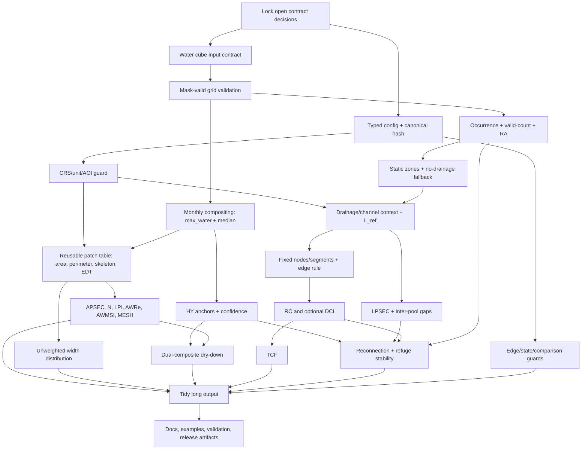

# HydroFragments v1.2 specification compliance audit

**Audit date:** 2026-07-10  
**Scope:** diagnosis only; no source files changed  
**Contract audited:** [`docs/HydroFragments_v1.2_spec.md`](../HydroFragments_v1.2_spec.md)  
**Verdict:** **not v1.2 compliant**. Current repository is a working legacy EcoFragments/iRiverMetrics-style snapshot pipeline, not the locked HydroFragments v1.2 architecture.

> **Mandatory next-phase intake gate**
>
> Before editing, next phase must read all three files in this order:
>
> 1. [`docs/audit/evidence_packet.md`](evidence_packet.md)
> 2. [`docs/audit/repo_triage.md`](repo_triage.md)
> 3. [`docs/audit/spec_compliance.md`](spec_compliance.md) (this report)
>
> This report refines two earlier findings: canonical WaterMask-TSFill datasets are rejected before sentinel processing; if `water_mask` is manually extracted, `uint8` sentinels are cast to signed `int8`, so `255` becomes `-1` and `254` becomes `-2`. They are ultimately converted to dry/background rather than safely carried as explicit validity states.

## Executive summary

Current implementation has useful reusable primitives:

- `xarray`/Dask raster ingestion and timestep batching;
- AOI polygon masking;
- 8-neighbour component labelling;
- minimum-patch filtering;
- skeletonisation, igraph longest-path length, and EDT pool width;
- legacy APSEC, LPSEC, N, AWRe, AWMSI, and RA-like calculations;
- unit and integration test scaffolding plus a basic GitHub Actions test matrix.

These primitives do not satisfy v1.2 contract. Critical breaks occur before metric correctness can be trusted:

1. Public API accepts one water-mask object, not water mask plus aligned valid-observation layer. Occurrence uses total timesteps as denominator.
2. Canonical WaterMask-TSFill Zarr/Dataset cannot be parsed. Its validity/provenance variables are discarded, and sentinel semantics are not preserved.
3. No monthly compositor, no `max_water`/`median` dry-down dual check, no hydrological-year anchors, and no confidence propagation exist.
4. Geographic input is reprojected to estimated UTM, not configured equal-area CRS. Raster is reprojected after AOI CRS validation, leaving AOI in old CRS on this path.
5. Legacy circular/redundant metrics `PF`, `PLF`, `AWMPA`, `AWMPL`, and `AWMPW` remain required by code and tests. LPI, MESH, dry-down, zoning, gaps, dynamics, and connectivity are absent.
6. Output is one wide `(date, section)` CSV without v1.2 metadata, flags, config hash, or tidy metric rows.
7. Existing tests assert legacy schema. Required v1.2 guards and edge cases have no coverage. Regression fixture points to a nonexistent file.
8. Package/docs remain split among `ecofragments`, `iRiverMetrics`, and `irivermetrics`; architecture docs explicitly claim generic terrestrial/urban scope, contradicting locked river focus.

Migration should preserve low-level label/skeleton/EDT work while introducing narrow module boundaries for input contract, config/CRS, temporal compositing, zones/HY, metrics, guards, and output schema. Rewrite of numerical kernels is not justified before contract tests expose actual failures.

## Audit basis and status legend

Evidence inspected:

- public API and orchestration: [`ecofragments/main.py`](../../ecofragments/main.py);
- metric/preprocessing implementation: [`ecofragments/utils/calc_metrics.py`](../../ecofragments/utils/calc_metrics.py);
- tests and fixtures: [`tests/`](../../tests);
- package/docs/CI: [`pyproject.toml`](../../pyproject.toml), [`README.md`](../../README.md), [`docs/`](..), [`.github/workflows/ci.yml`](../../.github/workflows/ci.yml);
- upstream contract: `D:\RLH\5.6\repos\WaterMask-TSFill\watermask_tsfill\contracts.py`, directly re-read during this audit;
- earlier audit artifacts named in intake gate.

Status meanings:

- **implemented**: contract exists and decisive code evidence matches it;
- **partially implemented**: useful implementation exists but required semantics, metadata, guards, or fallback are missing;
- **absent**: no implementation found;
- **contradicted by current code**: current behaviour or asserted schema conflicts with locked spec;
- **unclear**: repository evidence or spec decision is insufficient to decide.

Runtime evidence: `python -m pytest` stopped during collection because active audit environment lacks `dask_image`. Dependency is declared in `pyproject.toml`, so this is not counted as implementation failure. Independently, [`tests/conftest.py:34`](../../tests/conftest.py#L34) names `tests/results_ecofragments/metrics/ecof_metrics.csv`, while repository contains `tests/results_iRiverMetrics/metrics/irm_metrics.csv`; regression fixture is broken once collection dependencies are present.

## Current implementation map

| Stage | Current entry/function | Actual behaviour | Reusable for v1.2? |
|---|---|---|---|
| Public API | [`calculate_metrics()`](../../ecofragments/main.py#L10) | One mask input, polygon sections, legacy parameters; orchestrates delayed batches; writes wide CSV | Compatibility shim only |
| Input validation | [`validate()`](../../ecofragments/utils/calc_metrics.py#L226) | Accepts DataArray, Dataset, or TIFF directory; Dataset coerced to one variable | Partially; replace contract boundary |
| Dataset selection | [`coerce_water_mask_dataarray()`](../../ecofragments/utils/calc_metrics.py#L507) | Selects `water`, or sole variable; rejects canonical multivariable upstream Dataset | No, except legacy shim |
| CRS handling | [`validate_data_array_cm()`](../../ecofragments/utils/calc_metrics.py#L521) | Requires CRS; geographic input auto-reprojected to estimated UTM | Replace with configured equal-area/unit guard |
| AOI handling | [`validate_shp_input()`](../../ecofragments/utils/calc_metrics.py#L568), [`match_input_extent()`](../../ecofragments/utils/calc_metrics.py#L639) | Polygon-only sections; aligns AOI before possible raster reprojection | Preserve polygon operations after CRS ordering fix |
| Validity/QA | [`update_nodata_in_rcor_extent()`](../../ecofragments/utils/calc_metrics.py#L671), [`fill_nodata_darray()`](../../ecofragments/utils/calc_metrics.py#L779) | Infers validity from values; hard-coded 70%/95%; temporal fill uses sentinel `2`; final non-`1` becomes dry | Replace validity semantics; retain tested filling only if still required |
| Long-term persistence | [`calculate_pixel_persistence()`](../../ecofragments/utils/calc_metrics.py#L496), [`calculate_pixel_persistence_metrics()`](../../ecofragments/utils/calc_metrics.py#L876) | `sum(water) / number_of_timesteps`; mean only above 25%; RA above 90% | Replace denominator; reuse reduction shape |
| Patch labelling | [`find_connected_components()`](../../ecofragments/utils/calc_metrics.py#L890), [`pre_process_layer()`](../../ecofragments/utils/calc_metrics.py#L911) | 8-neighbour labelling; configurable minimum size passed from legacy API | Yes, behind explicit `connectivity_rule` and `min_patch_pixels` |
| Pool geometry | [`skeletonize_label()`](../../ecofragments/utils/calc_metrics.py#L898), [`compute_length_single_graph()`](../../ecofragments/utils/calc_metrics.py#L1032), [`process_edt_width()`](../../ecofragments/utils/calc_metrics.py#L1170) | Per-patch skeleton, longest path, one mean width per patch | Yes; add channel-aware AWRe rule and unweighted summaries |
| Metric aggregation | [`process_metrics()`](../../ecofragments/utils/calc_metrics.py#L426) | Computes legacy wide metrics including dropped metrics | Split/replace registry; formulas can seed APSEC/AWRe/AWMSI tests |
| Output | [`calculate_metrics()` lines 91-100](../../ecofragments/main.py#L91) | Pandas groupby then `ecof_metrics.csv`, one row per date/section | Replace writer; optional legacy adapter only |
| Spatial export | [`export_shapefiles()`](../../ecofragments/utils/calc_metrics.py#L408), PP export at [`main.py:121`](../../ecofragments/main.py#L121) | Optional shapefiles and naive persistence raster | Optional compatibility feature; not v1.2 spatial schema |

Current call path:

```text
calculate_metrics
  validate -> coerce_water_mask_dataarray -> validate_data_array_cm
  preprocess -> match_input_extent -> update_nodata_in_rcor_extent -> fill_nodata_darray
  preprocess_feature
    calculate_pixel_persistence_metrics
    pre_process_layer -> label + skeleton + EDT
  process_feature_batch -> summarize_block
    compute_area_and_perimeter_df
    compute_length_single_graph
    process_edt_width
  process_metrics -> wide DataFrame -> ecof_metrics.csv
```

## Compliance matrix

### A. Input, temporal, and spatial contracts

| ID | Requirement | Status | Exact evidence and gap | Depends on |
|---|---|---|---|---|
| A1 | Binary or thresholded probabilistic water mask **plus valid-observation layer** | **contradicted by current code** | [`calculate_metrics()`](../../ecofragments/main.py#L10) accepts only `da_wmask`; [`validate()`](../../ecofragments/utils/calc_metrics.py#L226) returns one DataArray. No valid-layer parameter or aligned pair object exists. | Contract decision Q1 |
| A2 | Generic GeoTIFF/NetCDF/Zarr source-agnostic input | **partially implemented** | DataArray and TIFF directory work; NetCDF works only when caller opens it. Zarr path is treated as TIFF directory. Multivariable Dataset selection is narrow. | A1 |
| A3 | Probabilistic mask threshold once; record threshold/method/source | **absent** | No probability input, threshold configuration, or metadata fields found in API/code/tests. | Config schema |
| A4 | Water/valid grids must match transform, CRS, shape; mismatch must raise | **absent** | No second raster exists to compare; therefore no alignment guard. | A1, CRS guard |
| A5 | Per-pixel occurrence `water_obs / valid_obs`; `min_valid_obs=20` default | **contradicted by current code** | [`calculate_pixel_persistence()`](../../ecofragments/utils/calc_metrics.py#L496) divides by `sizes['time']`; no valid count or floor. | A1 |
| A6 | Separate `min_valid_obs` and `min_valid_fraction_month` | **absent** | Hard-coded timestep thresholds `0.7` and `0.95` in [`update_nodata_in_rcor_extent()`](../../ecofragments/utils/calc_metrics.py#L671) and [`fill_nodata_darray()`](../../ecofragments/utils/calc_metrics.py#L779); no named scientific config. | Config schema, A1 |
| A7 | Monthly cadence and explicit compositing rule | **absent** | Pipeline treats every timestamp as metric row. No `resample`, cadence validation, compositor, or composite metadata. | A1, config |
| A8 | `max_water` default for general monthly series | **absent** | Only historical docs mention prior max composites; execution path does not composite. | A7 |
| A9 | `median` secondary composite for end-dry and dry-down; 10 pp default disagreement flag | **absent** | No median path, HY anchors, dry-down, tolerance, or `composite_sensitive`. | A7, HY, APSEC |
| A10 | Refuse/guard comparisons across composite rules | **absent** | No composite metadata or comparison API. | A7, output metadata |
| A11 | Equal-area computation, AU default EPSG:3577, or explicit per-pixel areas | **contradicted by current code** | [`validate_data_array_cm()` lines 555-564](../../ecofragments/utils/calc_metrics.py#L555) chooses estimated UTM for geographic input and scalar pixel size. No equal-area validation or per-pixel area array. | Config/CRS module |
| A12 | AOI and raster consistently reprojected before spatial operations | **contradicted by current code** | [`validate()` lines 273-277](../../ecofragments/utils/calc_metrics.py#L273) aligns polygon to original raster CRS, then may reproject raster only. Geographic-input path can leave AOI and raster in different CRSs. | A11 |
| A13 | Record CRS, area unit, length unit; document equal-area length-distortion caveat | **absent** | Wide CSV contains none. Current user docs say UTM/metric length but do not state equal-area versus equidistant caveat. | A11, output schema |
| A14 | Fixed `A_ref`/`A_total` from AOI polygon | **partially implemented** | [`preprocess_feature_operations()`](../../ecofragments/utils/calc_metrics.py#L837) computes polygon area and APSEC uses it. No named `A_ref`/`A_total`, equal-area proof, windows, or LPI/MESH reuse. | A11/A12 |
| A15 | `L_ref`: drainage centreline length; no-drainage maximum-wet skeleton proxy and flag | **contradicted by current code** | One global scalar `section_length` enters [`calculate_metrics()`](../../ecofragments/main.py#L10); it is neither derived per AOI from drainage nor generated from max-wet skeleton. Default is NaN. | Drainage contract, zones |
| A16 | Optional fixed channel windows / grid fallback | **absent** | No centreline windowing or regular-grid section generator. Polygon features are caller-supplied. | A11, drainage contract |

### B. WaterMask-TSFill compatibility

| ID | Requirement | Status | Exact evidence and gap | Depends on |
|---|---|---|---|---|
| B1 | Parse canonical variables `water_mask`, `confidence`, `method_flag`, `observed` | **contradicted by current code** | Upstream contract defines four variables. [`coerce_water_mask_dataarray()`](../../ecofragments/utils/calc_metrics.py#L507) accepts `water` or a single variable, so canonical Dataset raises. | A1/A2 |
| B2 | Preserve `water_mask` values 0/1/254/255 correctly | **contradicted by current code** | If caller manually extracts `water_mask`, [`update_nodata_in_rcor_extent()` line 704](../../ecofragments/utils/calc_metrics.py#L704) recognises only NaN/-1, then line 706 casts `uint8` to `int8`: 255 becomes -1, 254 becomes -2. Final binary conversion makes all non-1 values dry. Explicit invalid/outside states are lost. | Upstream adapter |
| B3 | Consume upstream native-observation validity | **absent** | `observed` never enters current execution path. Occurrence and monthly validity cannot distinguish observed from filled values. | Q1 validity semantics |
| B4 | Preserve confidence/method provenance where uncertainty needs propagation | **absent** | No confidence or method flag input/output columns. | Q1, output metadata |
| B5 | Use upstream monthly EPSG:3577 grid without unnecessary reprojection | **partially implemented** | Projected EPSG:3577 DataArray would remain projected in [`validate_data_array_cm()`](../../ecofragments/utils/calc_metrics.py#L521); canonical Dataset naming prevents direct use. | B1 |

### C. Zones, HY, and fallbacks

| ID | Requirement | Status | Exact evidence and gap | Depends on |
|---|---|---|---|---|
| C1 | Static Zones 1-4 from raw persistence plus optional drainage | **absent** | No zone module, thresholds, mask, or zone output found. | A5, drainage contract |
| C2 | No-drainage fallback emits Zones 2-4 only; Zone 1 skipped | **absent** | No drainage parameter or fallback branch. | C1 |
| C3 | Morphology-proxy Zone 1 prohibited | **partially implemented** | No such proxy exists, but this is vacuous because no zoning exists and no guard/test prevents later use. | C1 guards |
| C4 | Zone/persistence circularity guard | **absent** | Current output has no zones and no API constraint. | C1, metric registry |
| C5 | Persistence-based HY detection, anchors, confidence | **absent** | No `hy`, `hy_anchor`, detection, or confidence code. | A7, A5 |
| C6 | Graceful skip flags for channel/fixed-node/HY-dependent metrics | **absent** | Missing dependencies produce NaN only for `LPSEC`; no dependency or warning flags. | Output/guard schema |

### D. Metric register

| ID | Metric/decision | Status | Exact evidence and gap | Depends on |
|---|---|---|---|---|
| D1 | Occurrence frequency | **contradicted by current code** | `pp_mean_%` is filtered mean of naive persistence above 25%; optional `Pixel_Persistence.tif` uses same wrong denominator. | A1/A5 |
| D2 | Refuge Area (RA) | **partially implemented** | [`calculate_pixel_persistence_metrics()`](../../ecofragments/utils/calc_metrics.py#L876) counts pixels above 90%, but occurrence denominator and valid floor are wrong; no threshold metadata. | A5 |
| D3 | APSEC | **partially implemented** | Formula in [`process_metrics()` lines 460-474](../../ecofragments/utils/calc_metrics.py#L460) uses fixed polygon area and is reusable. Missing monthly composition, equal-area guarantee, validity flags, and long output. | A7/A11/output |
| D4 | LPSEC | **partially implemented** | Wetted skeleton length divided by caller scalar. Required `L_ref` derivation/fallback and CRS caveat are missing. | A15 |
| D5 | Number of pools N | **partially implemented** | 8-neighbour connected components and size filtering exist. Default is `min_patch_size=2`, not locked `min_patch_pixels=3`; connectivity is not selectable/recorded. | Guard config |
| D6 | LPI | **absent** | No largest-patch fixed-AOI calculation in code/tests. | A14, patch table |
| D7 | AWRe | **partially implemented** | Formula and per-patch skeleton length exist. Code always uses patch skeleton, lacks real-channel/validated-skeleton distinction, major-axis fallback, and `awre_length_method`. | Drainage/channel model |
| D8 | Dry-down rate | **absent** | No HY, recession-limb regression, dual composite, confidence, or diagnostic. | A7/A9/C5/D3 |
| D9 | AWMSI | **partially implemented** | Formula exists. N=0 returns 0 although spec requires patch/config metrics NaN; no edge flag or validation study. | Edge guards |
| D10 | MESH | **absent** | No `sum(a_i^2)/A_total` output or LPI/MESH correlation gate. | A14, patch table |
| D11 | Pool width distribution | **partially implemented** | EDT mean width per pool is computed in [`process_edt_width()`](../../ecofragments/utils/calc_metrics.py#L1170), then collapsed to forbidden area-weighted AWMPW. Required unweighted mean/median/max/CV rows absent. | Patch table, long schema |
| D12 | Inter-pool gap | **absent** | Skeleton paths describe wet patches only; no ordered channel dry-run analysis. | Channel reference |
| D13 | Reconnection timing | **absent** | No RC/DCI/LPSEC threshold timing, proxy flag, or output metadata. | C5, D4, D18/D20 |
| D14 | Refuge spatial stability | **absent** | No end-dry footprints or inter-HY Jaccard. | C5, A5 |
| D15 | TCF | **absent** | No fixed-node temporal graph. `PCF` does not occur in runtime code, but no naming guard/test exists. | Fixed nodes, D18 |
| D16 | DCI | **absent** | Neither optional implementation nor minimum conceptual positioning appears in current docs/code. Spec leaves implementation versus citation-only as judgment call. | Q3, fixed graph |
| D17 | Pixel recurrence and hydroperiod | **absent** | No year/HY grouped raster reductions. | A1/A7/C5 |
| D18 | Realised connectivity (RC) | **absent** | No fixed graph, edge rule, or node-source metadata. | Drainage/fixed nodes |
| D19 | Graph components/LCC support metrics | **unclear** | Not implemented; spec calls them optional support metrics, so absence is not independently noncompliant unless RC design selects them. | Q3/connectivity scope |
| D20 | NNI exploratory fallback | **absent** | No planar fallback or `Nlt10` flag. Not a core blocker, but no clustering output exists without channel. | D12 fallback policy |
| D21 | Drop PF and PLF | **contradicted by current code** | [`process_metrics()` lines 470-491](../../ecofragments/utils/calc_metrics.py#L470) computes/emits both; integration tests require them. | Metric registry migration |
| D22 | Drop/reformulate AWMPA/AWMPL/AWMPW | **contradicted by current code** | Same function emits all three; width must become unweighted distribution, AWMPA/AWMPL removed. | D10/D11 replacements |
| D23 | Do not implement centrality | **implemented** | No degree/betweenness output or graph centrality code found. | None |
| D24 | No bespoke PCF name | **partially implemented** | Runtime code contains no PCF, but no schema/naming guard exists and connectivity docs are absent. | Output validation |

### E. Guards, state, and output schema

| ID | Requirement | Status | Exact evidence and gap | Depends on |
|---|---|---|---|---|
| E1 | `min_patch_pixels=3` default, record pixels and area | **partially implemented** | Filtering exists as `min_patch_size`, default 2, with no area metadata. | Config schema |
| E2 | Configurable 8/4-neighbour `connectivity_rule`; record it | **partially implemented** | 8-neighbour hard-coded in [`find_connected_components()`](../../ecofragments/utils/calc_metrics.py#L890) and skeleton graph. No 4-neighbour option or metadata. | Patch config |
| E3 | N=0/1/2 edge semantics and flags | **contradicted by current code** | N=0 emits AWMSI/AWMPA/etc. as 0 and no `N0`; N=1/2 have no special handling. | Guard layer, output schema |
| E4 | Low-valid-observation flags and suppression | **absent** | Low-valid timesteps are globally dropped at hard-coded floors; no per-row/pixel flag or occurrence suppression metadata. | A1/A6 |
| E5 | Resolution/source tagging and cross-resolution guard | **absent** | No `source`, `resolution_m`, or comparison guard in returned table. | Output/config |
| E6 | State flags `dry`, `fragmented_wet`, `connected_wet` with declared metric/threshold | **absent** | No state column, connectivity choice, or thresholds. | D18/D4/D6, config |
| E7 | Fixed-node source and proxy-channel/reconnection guards | **absent** | No graph nodes, proxies, or corresponding metadata. | Connectivity/channel model |
| E8 | Tidy long table with identifiers, date/HY/zone/metric/value | **contradicted by current code** | [`calculate_metrics()` lines 91-100](../../ecofragments/main.py#L91) produces wide `(date, section)` columns and writes index-bearing CSV. | Output contract |
| E9 | Reproducibility metadata and config hash | **absent** | No run config file/hash, package version, git SHA, threshold/composite/unit/statistic/dependency columns. | Config + output |
| E10 | Counts/fractions/flags in every metric row | **absent** | No `n_valid_pixels`, `n_water_pixels`, `valid_fraction_month`, `edge_flag`, `warning_flag`, or dependency columns. | A1, output |
| E11 | Required spatial outputs | **partially implemented** | Optional naive PP raster only. Occurrence, recurrence, hydroperiod, valid-count, zones, refuge masks, and graph geometries absent. | D1/D17/C1/connectivity |

### F. Tests, documentation, packaging, and publication readiness

| ID | Requirement | Status | Exact evidence and gap | Depends on |
|---|---|---|---|---|
| F1 | v1.2 input/metric/guard tests | **absent** | Unit tests exercise legacy coercion, batching, clipping, naive persistence, and legacy aggregation only. | New contracts/modules |
| F2 | N=0/1/2, empty zone, no-drainage, low-valid, missing-anchor tests | **absent** | Existing zero-area test expects current legacy behaviour; other cases absent. | Guards/zones/HY |
| F3 | CRS, patch filter, connectivity rule, compositing, graph-node, naming tests | **absent** | No such tests. | Corresponding modules |
| F4 | Regression against published outputs as sanity, not equivalence | **partially implemented** | Legacy integration regression exists, but fixture path is wrong and expected schema includes dropped metrics. | Test data decision Q8 |
| F5 | Validation studies/gates in spec section 6.18 | **absent** | No AWRe/AWMSI, LPI/MESH, NNI, width, dual-composite, or RC/DCI validation artifacts found. | Metrics complete + real data |
| F6 | HydroFragments namespace/rebrand | **contradicted by current code** | Package/project is `ecofragments`; README/docs/notebook use `iRiverMetrics`/`irivermetrics`; example imports nonexistent module. | Compatibility decision Q4 |
| F7 | River-focused scope | **contradicted by current docs** | [`docs/architecture.md:5-12`](../architecture.md#L5) advertises generic aquatic, terrestrial, and urban patch dynamics. | Docs pass |
| F8 | Source-agnostic input and current metric docs | **contradicted by current docs** | README centres Water Detect and module2 documents dropped metrics/imports. No standalone input-format doc. | Contracts stable |
| F9 | Connectivity literature positioning and width/CRS/composite caveats | **absent** | Current user docs lack DCI/PC/IIC positioning and required new caveats. | Metrics/guards stable |
| F10 | CI lint + tests + docs build matrix | **partially implemented** | [`.github/workflows/ci.yml`](../../.github/workflows/ci.yml) tests Python 3.10/3.11; no lint or docs build. | Packaging/docs |
| F11 | LICENSE, CONTRIBUTING, CODE_OF_CONDUCT, support/templates | **absent** | None found in repository file inventory. | Governance decision |
| F12 | Hosted docs, practitioner quickstart, manager guide, paper, Zenodo | **absent** | Markdown docs exist but required deliverables/artifacts do not. | Stable API and validated outputs |
| F13 | Preserve predecessor history and six-month public development evidence | **contradicted by current local history** | Local Git history has one commit dated 2026-05-30: `Initial commit: ecofragments package (clean start)`. Remote points to HydroFragments GitHub, but public visibility/activity was not verified. Current local history does not demonstrate preserved iRiverMetrics history or six months. | Maintainer/repository action |

## Contradictions and blockers

### Blocker 1 — scientific denominator cannot be repaired downstream

No valid-observation layer survives input. Once preprocessing converts all non-water values to zero, occurrence, RA, valid fractions, and uncertainty flags cannot be reconstructed. This blocks zones, HY/persistence outputs, and every result relying on observation support.

Affected code:

- [`calculate_metrics()`](../../ecofragments/main.py#L10)
- [`validate()`](../../ecofragments/utils/calc_metrics.py#L226)
- [`calculate_pixel_persistence()`](../../ecofragments/utils/calc_metrics.py#L496)
- [`update_nodata_in_rcor_extent()`](../../ecofragments/utils/calc_metrics.py#L671)
- [`fill_nodata_darray()`](../../ecofragments/utils/calc_metrics.py#L779)

### Blocker 2 — temporal contract missing

Current rows mean “input timestep,” not “month under a recorded composite rule.” No correct dry-down, end-dry anchor, reconnection, stability, or composite-sensitivity result can be built on this ambiguity.

Affected code: new boundary before [`preprocess()`](../../ecofragments/utils/calc_metrics.py#L282); HY/dynamics modules absent.

### Blocker 3 — CRS and AOI ordering can invalidate geometry

Areas and lengths use scalar pixel size and current projection. Geographic inputs are converted to UTM instead of equal-area, and AOI is not reprojected after raster reprojection. This blocks defensible APSEC/LPI/MESH/RA areas and all length metrics.

Affected code:

- [`validate()` lines 273-277](../../ecofragments/utils/calc_metrics.py#L273)
- [`validate_data_array_cm()`](../../ecofragments/utils/calc_metrics.py#L521)
- [`preprocess_feature_operations()`](../../ecofragments/utils/calc_metrics.py#L837)
- [`compute_area_and_perimeter_df()`](../../ecofragments/utils/calc_metrics.py#L1196)

### Blocker 4 — legacy register is contractually inverted

Tests require metrics v1.2 removes. Replacement fixed-denominator/distributional metrics are missing. Extending `process_metrics()` in place risks emitting both incompatible schemas indefinitely.

Affected code: [`process_metrics()`](../../ecofragments/utils/calc_metrics.py#L426), [`tests/test_integration.py:52`](../../tests/test_integration.py#L52), [`docs/module2.md:110`](../module2.md#L110).

### Blocker 5 — no static spatial model for channel, zones, or nodes

One section polygon plus one scalar length cannot represent Zone 1, `L_ref`, gap ordering, fixed nodes, RC/TCF/DCI, or no-drainage degradation. A small explicit spatial-context boundary is needed before those metrics.

Affected code: public API and missing `zones/`, `hydroyear/`, `metrics/connectivity.py` boundaries.

### Blocker 6 — output loses scientific configuration

Wide CSV cannot carry distributional statistics, per-metric dependencies, multiple warning flags, or stable reproducibility fields without column explosion. Tidy schema and config hash must be contract-tested before adding many metrics.

Affected code: [`ecofragments/main.py:91-100`](../../ecofragments/main.py#L91).

### Blocker 7 — current test suite protects legacy behaviour

Tests explicitly require dropped columns and naive persistence. They cannot serve as v1.2 acceptance tests. Keep selected numerical-kernel regressions, but replace schema assertions.

Affected code: [`tests/test_unit_metrics.py`](../../tests/test_unit_metrics.py), [`tests/test_integration.py`](../../tests/test_integration.py), [`tests/conftest.py`](../../tests/conftest.py).

## Implementation dependency graph



Dependency rules:

| Upstream gap | Blocks |
|---|---|
| Valid-observation contract | occurrence, RA, valid floors, zones, recurrence, hydroperiod, uncertainty |
| Monthly composite contract | every monthly metric comparison, HY anchors, dry-down dual check |
| Equal-area/AOI guard | all area denominators; trustworthy patch areas; length metadata |
| Drainage/channel context | Zone 1, `L_ref`, LPSEC, gap, fixed graph, TCF/DCI |
| HY anchors/confidence | dry-down, reconnection lag, refuge stability |
| Fixed patch table | N, LPI, MESH, AWRe, AWMSI, width distribution |
| Fixed-node graph | RC, TCF, DCI, preferred reconnection |
| Config schema | reproducible thresholds, hash, guards, state flags, metadata |
| Long output schema | distributional metrics and flags without legacy column coupling |

## Test gap matrix

| Test family | Existing proof | Required v1.2 proof | Current state |
|---|---|---|---|
| Input adapters | DataArray passthrough; `water`/single-var Dataset coercion | generic mask+valid pair; canonical TSFill Dataset/Zarr; probabilistic threshold; explicit sentinel mapping | **absent; current ambiguous-Dataset test asserts wrong future behaviour** |
| Grid/CRS | clip bounds only | transform/CRS/shape equality; degree refusal/equal-area reprojection; AOI/raster post-transform alignment; units | **absent** |
| Monthly composites | none | max/median/mode/nearest rules; metadata; comparison refusal; 10 pp flag boundary | **absent** |
| Occurrence/RA | all-wet/all-dry/half-wet using total timestep count | uneven validity denominator; `min_valid_obs`; RA threshold; valid-count raster | **contradicted by tests** |
| Patch delineation | indirect integration | 4 vs 8 connectivity; default 3 pixels; filtered patch area; deterministic labels | **absent** |
| Core formulas | partial legacy group checks | exact APSEC/LPSEC/N/LPI/AWRe formulas; AWRe method fallback; dry-down slope/missing anchor | **partial/absent** |
| Secondary formulas | AWMSI positive only | MESH, unweighted width mean/median/max/CV, gaps, stability, reconnection | **absent** |
| Zones/fallback | none | threshold boundaries; Zone 1 with drainage; 2-4 without; circularity refusal; empty zone-month | **absent** |
| Connectivity | none | fixed node-source guard; RC edge/reachable pairs; TCF valid-month denominator; DCI reference fixture if selected | **absent** |
| Edge cases | legacy zero-area case | N0/N1/N2 flags/NaNs; low validity; no channel; proxy reconnection; missing HY | **absent; zero-area expectation conflicts** |
| Output schema | legacy column subset and CSV presence | exact tidy schema, data types, units/statistics, required metadata, config hash stability, warning composition | **absent** |
| Compatibility regression | published-style wide CSV comparison | selected unchanged kernels/formulas only; explicit legacy adapter test if retained | **partial; fixture path broken** |
| Validation | none | AWRe/AWMSI correlation; LPI/MESH hard gate; width interpretation; dual-composite magnitude; RC/DCI benchmark | **absent** |
| Docs/CI | CI runs tests on 3.10/3.11 | importable quickstart, docs build, lint, input-format examples | **partial** |

## Minimal refactor sequence

Sequence favours small contract-first migration, not wholesale rewrite. Each numbered item should be independently reviewable.

1. **Lock decisions.** Resolve questions below: canonical input object, validity semantics, compositor ownership, DCI scope, legacy API/output, drainage/HY contracts.
2. **Add v1.2 config and schemas without changing kernels.** Typed config; canonical serialization/hash; tidy output column contract; warning/edge enums; metadata requirements.
3. **Introduce input adapter boundary.** Accept generic `(water, valid)` pair and canonical WaterMask-TSFill Dataset/Zarr. Map sentinels before narrowing dtype. Validate grid equality. Preserve `observed`, confidence, and method provenance according to locked policy.
4. **Fix geometry boundary.** Reproject raster, AOI, and optional drainage together to configured equal-area CRS; support per-pixel area alternative; record units and length caveat. Add CRS tests before metric migration.
5. **Implement temporal layer.** Validate cadence, compose sub-monthly input, retain both `max_water` and `median` paths needed by dry-down, and expose valid fractions. Do not let legacy fill infer validity.
6. **Replace persistence path.** Implement occurrence/valid-count/RA, recurrence, hydroperiod. Then build HY anchors/confidence. These unlock zones and dynamics.
7. **Build spatial context.** Add zone mask, drainage/no-drainage paths, `A_ref`/`A_total`/`L_ref`, window IDs, dependency flags. Enforce no morphology Zone 1 and no persistence-by-derived-zone.
8. **Extract reusable patch table from current kernels.** Preserve component labelling, skeleton, regionprops, and EDT. Add configurable connectivity and minimum mapping unit. Store per-patch geometry once, including AWRe length method.
9. **Migrate metric register.** Add APSEC/LPSEC/N/LPI/AWRe first; remove PF/PLF/AWMPA/AWMPL/AWMPW from v1.2 output; add AWMSI/MESH and unweighted width summaries. Keep legacy wide output only behind explicit adapter if approved.
10. **Add channel/dynamics metrics.** Inter-pool gaps, dry-down dual check, end-dry stability, then reconnection fallback chain.
11. **Add connectivity module.** Fixed nodes/segments, RC, optional DCI decision, TCF, graph metadata, state flags. Never identify transient monthly patches across time.
12. **Emit and validate final artifacts.** Tidy long table, spatial rasters/masks, machine-readable config, config hash, all counts/flags. Add one end-to-end synthetic contract fixture plus WaterMask-TSFill fixture.
13. **Rebrand and document after API stabilises.** `hydrofragments` namespace, current quickstart/input spec, river-only architecture, literature/caveats, manager guide, validation inventory. Add compatibility import only if approved.
14. **Release readiness.** Fix/replace legacy regression data, extend CI to lint/docs, add license/governance files, preserve or document predecessor history, and start verifiable open-development clock. Publication submission remains later work.

Suggested module seams are those in v1.2 spec (`io`, `zones`, `hydroyear`, `metrics`, `aggregate`, `guards`), but migration need not move every helper immediately. First deep seam should be an immutable/validated water-cube object passed to metric modules; second should be a patch table independent of output layout.

## Questions before editing

1. **Validity semantics:** for WaterMask-TSFill, should `observed=True` be sole valid-observation denominator, or can resolved/fill pixels count as valid under confidence/method rules? Spec wording implies native observed only; confirm because this changes occurrence, RA, and monthly-validity results.
2. **Canonical API:** prefer a `WaterCube`/Dataset contract containing water, valid, optional confidence/provenance, or separate `water_mask=` and `valid_obs=` parameters with adapter constructors?
3. **Monthly ownership:** must HydroFragments composite raw sub-monthly masks itself, or may callers provide already-monthly masks plus mandatory `monthly_composite` provenance? WaterMask-TSFill is already monthly, so dual-composite dry-down cannot be reconstructed from that output alone unless upstream also exposes source observations or both composites.
4. **DCI decision:** implement monthly reach-length-weighted DCI in v1, or meet minimum contract through explicit literature positioning plus external validation benchmark?
5. **Compatibility policy:** retain `ecofragments.calculate_metrics()` and legacy wide CSV as deprecated shims, or make v1.2 a clean namespace/schema break? Minimal user disruption favours a thin shim, never mixed columns in canonical output.
6. **Drainage input:** what exact line dataset and topology contract is available? Current `rcor_extent` is polygon-only and `section_length` is one scalar, insufficient for per-AOI `L_ref`, Zone 1, gaps, and fixed graphs.
7. **HY algorithm:** spec requires persistence-based detection, anchors, and confidence but does not fully lock algorithm/parameters in executable detail. Which algorithm and drought fallback are authoritative for v1.2?
8. **Validation data:** should bundled `wmask_ts.nc` remain only legacy regression data, with new small synthetic fixtures plus a versioned Gilbert/WaterMask-TSFill validation subset? Current fixture content could not be inspected in audit environment because NetCDF backend dependencies are missing.
9. **Config hashing:** should paths be excluded or content-addressed so scientifically identical configs hash identically across machines? Lock before emitting `config_hash`.
10. **Publication history:** can original iRiverMetrics Git history be grafted/preserved in this repository, or must publication docs transparently link predecessor history as separate evidence? Local repository currently contains one clean-start commit.

## Audit conclusion

No single metric patch will make current repository compliant. Input validity, temporal compositing, CRS, spatial context, and output schema are prerequisite contracts. Once those exist, current label/skeleton/EDT kernels can support a minimal robust migration. First implementation phase should stop after contract schemas, adapters, CRS alignment, and tests pass; only then migrate scientific metrics.
