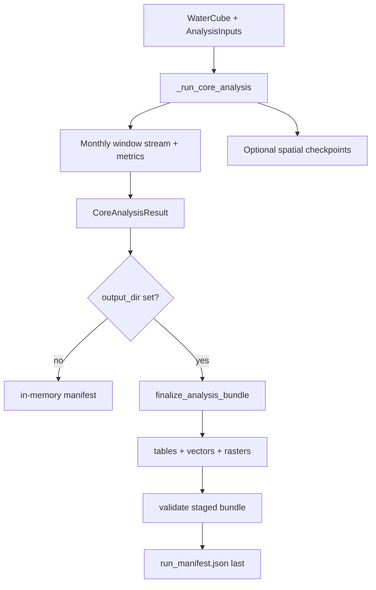

# Specification: Dynamics Metrics and Spatial Data Export

**Date:** 2026-08-12  
**Status:** Implemented (frozen contracts)  
**Package version:** HydroFragments `0.1.0`  

This specification matches the audited implementation plan in
`docs/superpowers/plans/2026-08-12-dynamics-and-spatial-exports.md`. It is the
user-facing design record for what shipped in 0.1.0, not a forward-looking draft.

---

## 1. Version boundaries

Keep four versions distinct:

| Boundary | Value | Notes |
|----------|-------|-------|
| Package | `0.1.0` | `hydrofragments.__version__` |
| Config schema | `1.0.0`, `1.1.0` | `1.1.0` adds spatial products; semantically equivalent inputs hash the same scientifically |
| Metric row schema | `1.1.0` | New `EdgeFlag` enum values; no column changes |
| Run manifest schema | `1.1.0` | Artifact inventory with SHA-256 digests and spatial metadata |

Readers accept legacy metric/manifest `1.0.0` under original contracts.

---

## 2. Dynamics metrics

### 2.1 Profile wiring

`PROFILES["dynamics"]` includes `extent_contraction`, `reconnection_timing`, and
`refuge_spatial_stability`. `_dynamics_profile_records()` in `hydrofragments/api.py`
orchestrates all three when prerequisites exist.

### 2.2 Configuration (`DynamicsConfig`)

```python
reconnection_lpi_threshold_pct: float = 50.0
reconnection_lpsec_threshold_pct: float = 50.0
```

Both are percentages on `[0, 100]`, finite, validated at parse time, and included
in `scientific_config()` / scientific hash.

### 2.3 `reconnection_timing`

- **Unit:** month (integer calendar-month lag)
- **Provider precedence:** RC (future) → LPSEC (complete live channel inputs) → LPI (internal support)
- **Search:** After `end_dry` (exclusive) until next HY `end_dry` (exclusive) or record end
- **No fallback** when preferred series never crosses threshold (`no_threshold_crossing`)
- **Proxy flag:** `proxy_reconnection_flag=True` for LPSEC and LPI
- **Record fields:** `date`, `hy`, `hy_anchor`, `hy_confidence`, `connected_wet_metric`, `connected_wet_threshold`, `reconnection_metric_used`, `proxy_reconnection_flag`, `warning_flags`

### 2.4 `refuge_spatial_stability`

Scalar Jaccard on common-valid support between consecutive end-dry refuge masks.
Empty union is undefined (`NaN`/non-reportable), not zero. First HY is
non-reportable.

**Edge flags (schema 1.1.0):** `missing_HY_anchor`, `no_previous_HY`,
`nonconsecutive_HY`, `low_common_valid_support`, `empty_refuge_union`,
`no_threshold_crossing`.

### 2.5 Per-pixel stability rasters

Separate from scalar Jaccard:

```text
frequency_pct[p] = 100 * stable_count[p] / eligible_union[p]
```

Pixels with `eligible_union == 0` are nodata.

---

## 3. Spatial grid contract

Immutable `SpatialGrid` value object at every raster/vector boundary. Validation
compares CRS, affine transform, coordinate values/order, dimensions, and shape.
Shape equality alone is insufficient.

Spatial export against a cube without resolvable CRS/transform fails early;
tabular analysis remains allowed.

---

## 4. Spatial products

### 4.1 Configuration (`OutputConfig`, schema `1.1.0`)

```python
spatial_products: tuple[
    Literal[
        "monthly_pools",
        "zones",
        "persistence_rasters",
        "temporal_rasters",
        "refuge_stability_rasters",
        "reach_profiles",
    ], ...
] = ()
raster_formats: tuple[Literal["geotiff", "netcdf"], ...] = ("geotiff",)
```

- `include_vectors` is a deprecated alias for `monthly_pools` (one cycle).
- Non-empty `spatial_products` requires explicit `output_dir`.
- Output selections are in `execution_config()`, not `scientific_config()`.
- Spatial exports are **off by default**.

### 4.2 Raster contracts

| Product | File | dtype | nodata |
|---------|------|------:|--------|
| occurrence | `rasters/occurrence.tif` | float32 | NaN |
| valid observation count | `rasters/valid_observation_count.tif` | uint32 | 4294967295 |
| refuge mask | `rasters/refuge_mask.tif` | uint8 | 255 |
| hydrological zone | `rasters/zones.tif` | uint8 | 0 |
| recurrence | `rasters/recurrence.tif` | float32 | NaN |
| recurrence valid-year count | `rasters/recurrence_valid_year_count.tif` | uint16 | 65535 |
| hydroperiod | `rasters/hydroperiod_by_year.tif` | float32 | NaN |
| hydroperiod valid-month count | `rasters/hydroperiod_valid_month_count_by_year.tif` | uint8 | 255 |
| refuge overlap | `rasters/refuge_overlap_by_hy.tif` | uint8 | 255 |
| refuge stability frequency | `rasters/refuge_stability_frequency.tif` | float32 | NaN |
| refuge union-pair count | `rasters/refuge_stability_union_pair_count.tif` | uint16 | 65535 |

GeoTIFF writes use tiled DEFLATE compression (256×256 tiles). Products are
**not** advertised as Cloud Optimized GeoTIFF unless separately validated.

NetCDF (`rasters/spatial.nc`) requires `pip install hydrofragments[netcdf]`.

### 4.3 Vector contracts

Single GeoPackage: `vectors/spatial.gpkg`

**`monthly_pools` layer** — checkpoint-only polygonization from canonical filtered
labels. Schema: `date`, `pool_id`, `label_id`, `n_pixels`, `area_m2`,
`perimeter_m`, `major_axis_length_m`, `width_m`, `elongation_ratio`,
`shape_index`, `geometry`. No per-feature AWRE/AWMSI aggregates.

**`zones` layer** — dissolved features: `zone_id`, `zone_name`, `area_km2`,
`source`, geometry.

**`reaches` layer** — one geometry per reach with stable `reach_id`.

**`reach_wet_monthly` layer** — non-spatial table: `reach_id`, `date`, `is_wet`,
`length_m`, `lpsec_contribution_pct`.

Unavailable requested products raise `SpatialProductUnavailable` at preflight.

### 4.4 Output layout

```text
<output_dir>/
  config.json
  metrics/                              # partitioned Parquet
  metrics.csv                           # when CSV selected
  metric_coverage.csv
  vectors/spatial.gpkg
  rasters/*.tif
  rasters/spatial.nc                    # optional
  run_manifest.json                     # always last
```

`output_dir` must be absent or empty before the run. Bundle commit uses one
same-filesystem directory rename after full staged validation.

---

## 5. Pipeline architecture



- One owner for tables, spatial writes, validation, and manifest publication.
- `HydroResult.write()` is table/coverage only; spatial products require
  `output.spatial_products` before `analyze()`.
- Export-off metric tables are byte-identical to export-on for the same config
  (excluding spatial product selection).
- No reprojection during export; source CRS/grid preserved.

---

## 6. Performance evidence

Controlled subprocess benchmarks (`benchmarks/results/dynamics_spatial_exports.md`):

| Gate | Result |
|------|--------|
| Export-off median regression vs baseline | ≤10% (observed ~4.3%) |
| All-products peak RSS vs core | ≤125% (observed ~106%) |
| Metric/coverage parity export on/off | Pass |
| Checkpoint export retry skips source reads | Pass |

Do not claim general “faster” speedups from this work; export-off path includes
bounded scientific spill cost and meets the ≤10% regression gate.

---

## 7. Product availability matrix

| Product / metric | `analyze()` cube only | `analyze()` + optional inputs | `analyze_from_dea()` |
|---|---:|---:|---:|
| extent contraction | no | yes, HY + dual composites | yes when derived |
| reconnection (LPI) | no | yes, HY extent | yes |
| reconnection (LPSEC) | no | yes, HY + channel profiles | yes when profiles exist |
| scalar refuge stability | no | yes, HY + ≥2 anchors | yes |
| persistence/temporal rasters | yes, valid grid | yes | yes |
| refuge-stability rasters | no | yes, HY + ≥2 anchors | yes |
| monthly pool polygons | yes, when selected | yes | yes |
| zone raster/polygons | no | yes, zone input | yes |
| reach layers | no | yes, channel context | yes |

---

## 8. Verification

Automated coverage includes:

- Dynamics edge-case unit tests (`tests/metrics/test_dynamics_edges.py`)
- Spatial grid, raster, vector, bundle round-trip tests
- Integration tests (`tests/integration/test_spatial_exports.py`)
- Offline example (`examples/spatial_exports.py`) exercised in CI
- Windows/Python 3.13 spatial writer smoke job

Manual release check: open bundle in QGIS, confirm alignment, nodata, band labels,
and `validate_result_bundle()` pass.

---

## 9. Non-goals (unchanged)

- No automatic EPSG:3577 stamping on unreprojected cubes
- No COG claim without separate validation
- No GPU processing, tile server, or database
- No change to published metric formulae
- RC/TCF runtime connectivity metrics remain deferred
